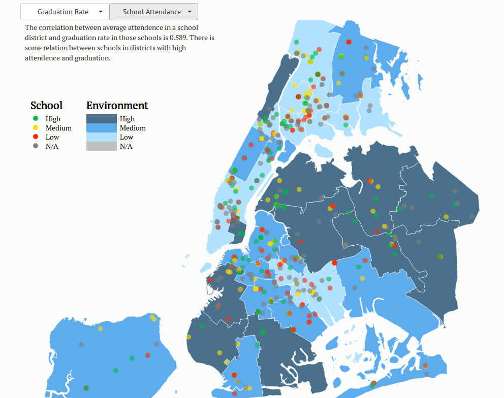

Visualize New York City Schools
===============================

Members
-------

*   Hannah Keiler
*   Jeremy Meyers
*   George Tsai
*   Stephen Zhou

Summary
-------

We are exploring and visualizing the relationship between the local New York
City environment and school performance using public data sets from nyc.gov and
NYC Open Data for our Fall 2013 Intro to Data Science course project.

Folder Hierarchy
----------------

    .
    ├── css             Our custom css
    ├── js              Our custom js
    ├── json            Our JSON files
    ├── lib             Third-party libraries
    │   ├── bootstrap
    │   ├── d3
    │   ├── jquery
    ├── resource        Some HTML display messages
    ├── scripts         Our scripts
    │   └── school_info_join
    ├── about.html      About page
    ├── findings.html   Findings summary page
    ├── index.html      Main map page
    └── README.md       This file

Dependencies and Tools
----------------------

*   Bootstrap - HTML and CSS templates
*   D3.js -  a Javascript library that aids in the creation and control of
    interactive graphics on the web
*   Github - collaboration and version control
*   Quantum GIS (QGIS) - an open source geographic information systems (GIS)
    application
*   R for statistical analysis
   
Instructions
------------

Usage instructions as well as group documentation of data processing methods.

### Usage

Start a HTTP server in the directory. I recommend Python's SimpleHTTPServer.

    $ python -m SimpleHTTPServer 8080

Then, go to localhost:8080 on your browser.

Otherwise, visit http://visualizeschools.com/ for a relatively up-to-date
deployment of the site.

### Simplify Shapefiles

The Shapefiles provided by NYC.gov are far too detailed for the purposes for
this project's visualization. Converted to GeoJSON format, each map is a
whooping 3.8 MB.

To make the size more manageable so interactive components like pan and zoom
aren't laggy, we should first simplify the maps. This can be done easily using
QGIS.

1.  Open QGIS and add the Shapefile vector
2.  Vector > Geometry Tools > Simplify geometries
3.  Select input features, set the Save as to another directory, pick a
    tolerance level
    *   As a reference, a tolerance of 10 cuts the filesize down from 3.8 MB to
        926 KB 
4.  Click OK

### Convert Shapefiles to GeoJSON

The shapefiles encode the location coordinates using the Universal Transverse
Mercator (UTM) coordinate system, which D3 geo does not support.

In order to map on D3, we must convert the shapefiles into GeoJSON format and
the UTM coordinates into lat/long (either NAD83 or WGS72).

1.  Open the shp file in QGIS
2.  Layer > Save As
    *   Format: GeoJSON
    *   CRS: either NAD83 or WGS 72 
3.  Specify a file name
4.  Save

### Merge GeoJSON Files with Statistics

GeoJSON files can be merged with data in two ways.

#### Python Script

Write a quick script using the json and csv Python libraries. Basically, just
read the GeoJSON file in, convert it to a JSON object, and then add the new
dataset in the appropriate place within the JSON data structure.

See scripts/school\_info\_join for an example.

#### QGIS

1. Layer > Add vector layer csv and/or json files
2. Layer > properties > Joins
3. Add vector join
4. Layer > attribute table to check joins
5. Save as GeoJSON with CRS NAD83

### Statistical Analysis Code
*   backgroundcode.R : the code for the graphs used in the midterm report
*   cluster\_ANOVA.xls : analysis for the ANOVA on the cluster metric across all 32 districts
*   popuptextstats.R : the code for the correlation between the district variables and the school metrics and the ANOVA tests for significant district variables
*   schoolclustercode.R : code for doing the k-means clustering to determine the school cluster
*   websitemerging.R : merges the school information for the dataset to be used on the website

Attribution
-----------

*   [NYC Open Data](https://nycopendata.socrata.com/) for data sets
*   [NYC.gov](http://www1.nyc.gov/) for data sets and NYC shapefiles
*   [Mike Bostock](http://bl.ocks.org/mbostock) for D3 examples and some
    borrowed CSS templating
